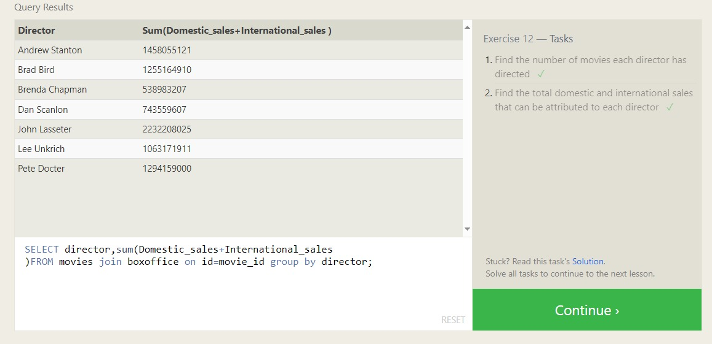
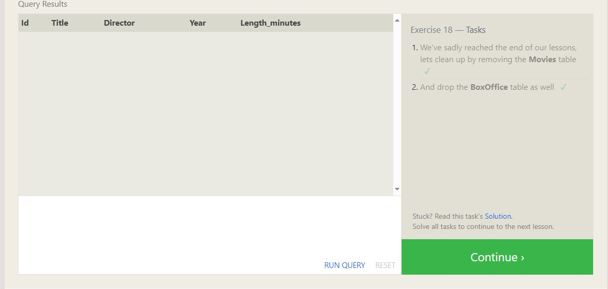

### MySql Queries
##### SQL Lesson 1: SELECT queries

##### SQL Lesson 2: Queries with constraints

##### SQL Lesson 3: Queries with constraints

##### SQL Lesson 4: Filtering and sorting Query results

#### SQL Review: Simple SELECT Queries;

##### SQL Lesson 6: Multi-table queries with JOINs

##### SQL Lesson 7: OUTER JOINs

##### SQL Lesson 8: A short note on NULLs

##### SQL Lesson 9: Queries with expressions

##### SQL Lesson 10: Queries with aggregates

##### SQL Lesson 11: Queries with aggregates

##### SQL Lesson 12: Order of execution of a Query

##### SQL Lesson 13: Inserting rows

##### SQL Lesson 14: Updating rows
  
##### SQL Lesson 15: Deleting rows

##### SQL Lesson 16: Creating tables

##### SQL Lesson 17: Altering tables

##### SQL Lesson 18: Dropping tables

